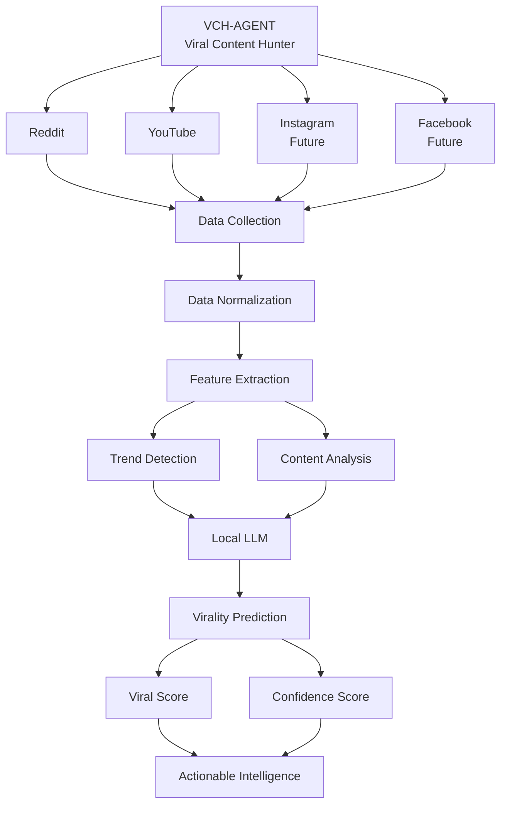
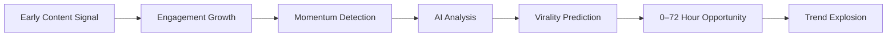
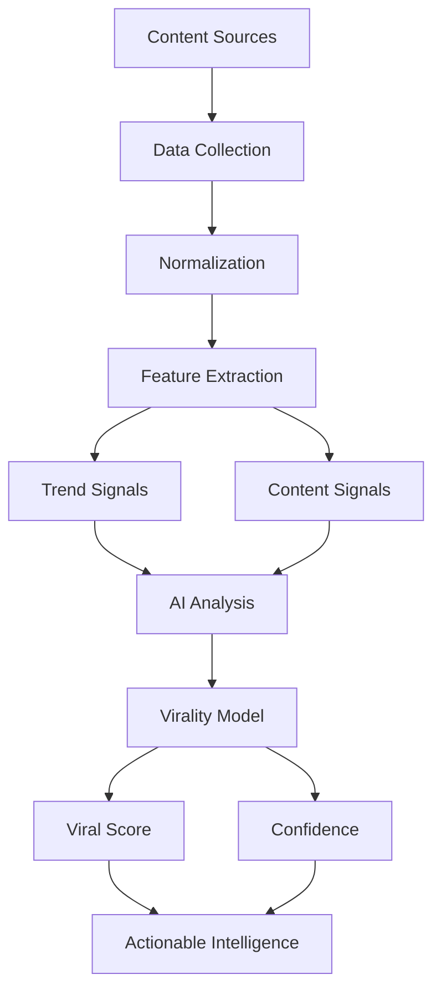
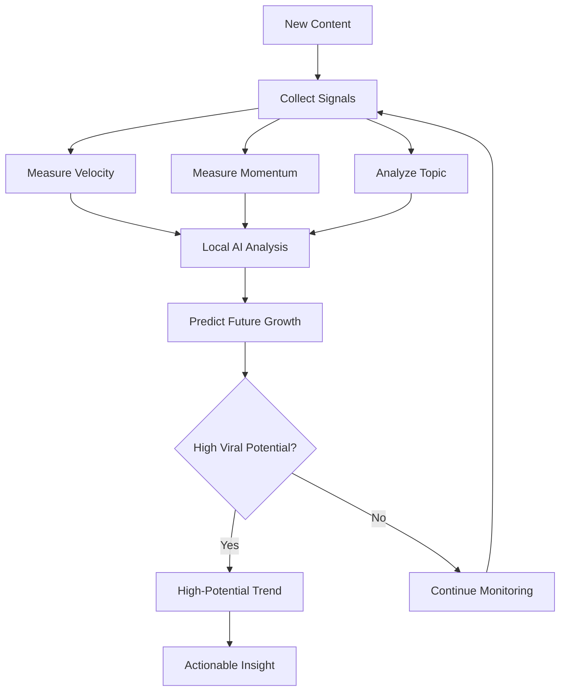
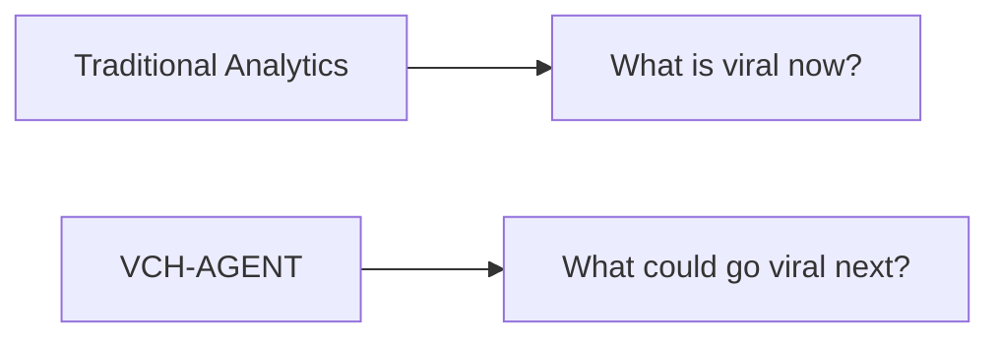

<p align="center">
  
</p>

<h1 align="center">VCH-AGENT</h1>

<p align="center">
  <strong>Viral Content Hunter</strong>
</p>

<p align="center">
  <em>Predict. Analyze. Hunt. Go Viral.</em>
</p>

<p align="center">
  An AI-powered content intelligence system designed to detect emerging trends, analyze content signals, and predict viral potential before trends explode.
</p>

<p align="center">
  
  
  
  
  
</p>

---

## 🎯 What is VCH-AGENT?

**VCH-AGENT (Viral Content Hunter)** is an AI-driven content intelligence and trend prediction system designed to identify content with growing viral potential.

Instead of waiting until a topic has already become viral, VCH-AGENT focuses on **early signals** such as engagement velocity, content momentum, growth acceleration, audience interest, and platform activity.

The goal is simple:

> **Find the signal before the trend becomes obvious.**

---

## 🧠 System Architecture



---

## ⚡ The 72-Hour Advantage

VCH-AGENT is designed around an important idea:

**Detect emerging content before it reaches peak attention.**



The objective is not simply to identify what is viral **now**, but to identify what has the potential to become viral **next**.

---

# 🔍 Core Capabilities

### Early Trend Detection

Identify emerging discussions and content using signals such as:

- Engagement velocity
- Content momentum
- Growth acceleration
- Interaction activity
- Topic relevance
- Audience interest

### 📊 Virality Prediction

Analyze collected signals to estimate whether content demonstrates characteristics associated with viral growth.

The prediction layer is designed to produce:

```text
Viral Score
Confidence
Trend Strength
Growth Momentum
Prediction Reasoning
```

### 🤖 AI-Powered Analysis

VCH-AGENT includes support for **local LLM processing**, allowing AI analysis to be performed locally rather than making every operation dependent on cloud AI services.

### 🔴 Reddit Intelligence

Reddit is one of the primary content sources.

The system can work with signals including:

- Posts
- Discussions
- Engagement
- Community activity
- Emerging topics
- Content momentum

### ▶️ YouTube Intelligence

YouTube provides another major source of trend signals.

Potential signals include:

- Views
- Engagement
- Video popularity
- Audience response
- Topic trends
- Growth patterns

### 🌐 Multi-Platform Expansion

The architecture is designed to expand to additional platforms.

Planned integrations include:

- 📸 Instagram
- 📘 Facebook
- 🎵 TikTok
- 𝕏 X
- Additional public content sources

These should be treated as **future integrations** unless implemented in the current codebase.

---

# 🔄 Intelligence Pipeline



---

# 🏗️ Project Structure

```text
VCH-AGENT/
│
├── assets/
│   └── vch-agent-banner.png
│
├── src/
│   └── vch/
│       ├── __init__.py
│       ├── __main__.py
│       ├── cli.py
│       ├── config.py
│       ├── database.py
│       ├── domain.py
│       ├── extractors.py
│       ├── local_llm.py
│       ├── reddit.py
│       ├── service.py
│       └── youtube.py
│
├── tests/
│   ├── test_cli.py
│   ├── test_feature_slice.py
│   ├── test_local_llm.py
│   ├── test_reddit.py
│   └── test_youtube.py
│
├── .env.example
├── .gitignore
├── ARCHITECTURE_AUDIT.md
├── pyproject.toml
└── README.md
```

---

# 🧩 Core Components

| Component       | Purpose                       |
| --------------- | ----------------------------- |
| `reddit.py`     | Reddit data collection        |
| `youtube.py`    | YouTube data collection       |
| `extractors.py` | Content and signal extraction |
| `domain.py`     | Core domain models            |
| `service.py`    | Application/service logic     |
| `local_llm.py`  | Local AI/LLM processing       |
| `database.py`   | Data persistence              |
| `config.py`     | Configuration management      |
| `cli.py`        | Command-line interface        |

---

# 🧪 Testing

VCH-AGENT includes automated tests covering important parts of the system.

```bash
pytest
```

Current test areas include:

- CLI behavior
- Feature processing
- Local LLM functionality
- Reddit integration
- YouTube integration

---

# ⚙️ Installation

## 1. Clone the repository

```bash
git clone https://github.com/ajeem-suban/VCH-AGENT.git
cd VCH-AGENT
```

## 2. Create a virtual environment

### Windows

```bash
python -m venv .venv
.venv\Scripts\activate
```

### Linux / macOS

```bash
python3 -m venv .venv
source .venv/bin/activate
```

## 3. Install the project

```bash
pip install -e .
```

## 4. Configure environment variables

Copy:

```text
.env.example
```

to:

```text
.env
```

Then configure the required API credentials and application settings.

**Never commit `.env` or expose API keys publicly.**

---

# 🚀 Running VCH-AGENT

Run:

```bash
python -m vch --help
```

This displays the commands available in the current implementation.

The main module can also be invoked with:

```bash
python -m vch
```

---

# 📈 Conceptual Prediction Flow



---

# 💡 Why VCH-AGENT?

Traditional analytics primarily answers:

> **What is popular right now?**

VCH-AGENT aims to answer:

> **What could become popular next?**



This makes **early detection** the central concept of the project.

---

# 🔬 Research Direction

VCH-AGENT can evolve into a predictive content intelligence platform combining:

- Time-series analysis
- Natural Language Processing
- Machine Learning
- Large Language Models
- Social media analytics
- Engagement modeling
- Trend detection
- Anomaly detection
- Cross-platform correlation
- Predictive modeling

The broader objective is to identify **weak signals before they become strong signals**.

---

# 🛡️ Security

Never commit:

```text
.env
API keys
Access tokens
Private credentials
Database secrets
```

Use `.env.example` to document required configuration variables without exposing credentials.

---

# 📜 License

Add your chosen open-source license here.

---

# 👨‍💻 Author

**AJEEM SUBAN**

B.Tech — Artificial Intelligence & Data Science

AI/ML Developer | AI Systems Builder

---

<p align="center">
  <strong>VCH-AGENT</strong>
  <br>
  <em>Hunting Viral Content. Before It Happens.</em>
</p>

<p align="center">
  ⭐ Star the repository if you find the project interesting.
</p>
