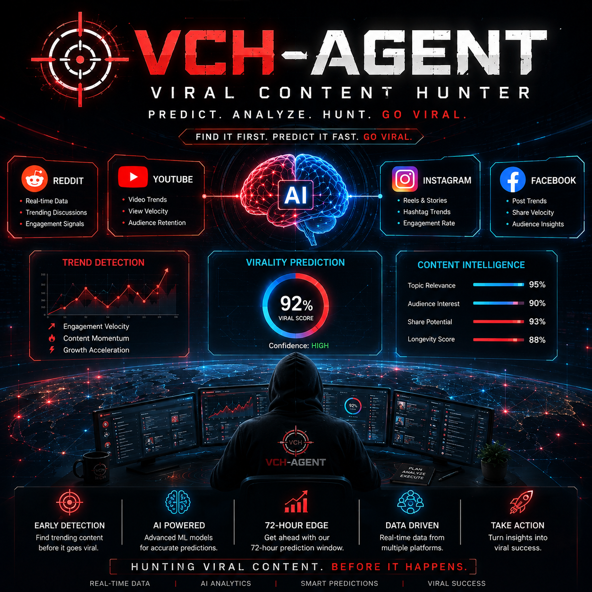
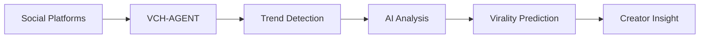

<p align="center">
  
</p>

<h1 align="center">VCH-AGENT</h1>

<p align="center">
  <strong>Viral Content Hunter</strong>
</p>

<p align="center">
  AI-powered content intelligence for creators, influencers, and celebrities.
</p>

---

## About

**VCH-AGENT** is an AI-powered system built to discover emerging content trends and identify opportunities before they reach peak attention.

Instead of simply asking **"What is trending now?"**, VCH-AGENT focuses on a more useful question:

> **"What could become popular next?"**

The idea is simple — collect early signals from social platforms, analyze their momentum, and turn them into useful insights for people who create content.

---

## 🎯 Built for Creators

VCH-AGENT is designed with **influencers, celebrities, content creators, YouTubers, social-media managers, and personal brands** in mind.

It can help creators:

- Discover emerging topics
- Identify rising conversations
- Understand audience interest
- Find content opportunities early
- Compare trend momentum
- Decide what to create next
- Act before a trend becomes saturated

The goal is not to tell creators what is already viral.

**The goal is to help them find what might be viral next.**

---

## How It Works



VCH-AGENT collects content signals, analyzes their growth and engagement patterns, and produces intelligence that can help creators make better content decisions.

---

## Current Platform Focus

### 🔴 Reddit

Reddit provides valuable signals from communities and discussions, helping identify topics that are beginning to gain attention.

### ▶️ YouTube

YouTube provides content and engagement signals that can help identify rising topics and audience interests.

### 📸 Instagram & 📘 Facebook

Instagram and Facebook are part of the broader multi-platform vision of VCH-AGENT and can be integrated as the platform develops.

---

## Core Capabilities

### 🔍 Trend Detection

Identify topics and discussions that are showing signs of increasing attention.

### 📈 Momentum Analysis

Analyze engagement and growth signals to understand whether interest around a topic is accelerating.

### 🤖 AI Analysis

Use AI to analyze content and provide meaningful context around emerging trends.

### 🎯 Virality Prediction

Estimate the potential of emerging content based on available signals and patterns.

### ⏱️ Early Opportunity Detection

The long-term objective is to provide creators with an **early-mover advantage**, including a potential **72-hour opportunity window** for promising trends.

> The 72-hour concept is a project objective, not a guarantee that every prediction will be accurate.

---

## Example

A future VCH-AGENT insight could look like:

```text
🔥 TREND ALERT

Topic: Emerging Topic XYZ

Momentum: HIGH
Growth: ACCELERATING
Viral Potential: HIGH

Recommended Platforms:
YouTube + Instagram

Why:
Engagement around the topic is increasing rapidly
across multiple communities.

Creator Opportunity:
Create content around the topic before attention peaks.
```

---

## Project Structure

```text
VCH-AGENT/
│
├── assets/
│   └── vch-agent-banner.png
│
├── src/
│   └── vch/
│       ├── __init__.py
│       ├── __main__.py
│       ├── cli.py
│       ├── config.py
│       ├── database.py
│       ├── domain.py
│       ├── extractors.py
│       ├── local_llm.py
│       ├── reddit.py
│       ├── service.py
│       └── youtube.py
│
├── tests/
│   ├── test_cli.py
│   ├── test_feature_slice.py
│   ├── test_local_llm.py
│   ├── test_reddit.py
│   └── test_youtube.py
│
├── .env.example
├── .gitignore
├── ARCHITECTURE_AUDIT.md
├── pyproject.toml
└── README.md
```

---

## Tech Stack

- **Python**
- **Local LLM**
- **Reddit**
- **YouTube**
- **SQLite / Data Persistence**
- **Pytest**
- **Environment-based Configuration**

---

## Installation

Clone the repository:

```bash
git clone https://github.com/ajeem-suban/VCH-AGENT.git
cd VCH-AGENT
```

Create a virtual environment:

### Windows

```bash
python -m venv .venv
.venv\Scripts\activate
```

### Linux / macOS

```bash
python3 -m venv .venv
source .venv/bin/activate
```

Install the project:

```bash
pip install -e .
```

Configure your environment:

```text
.env.example → .env
```

Add the required API credentials and configuration values.

**Never commit your `.env` file or expose API keys.**

---

## Run

To view the available commands:

```bash
python -m vch --help
```

Run the application with:

```bash
python -m vch
```

---

## Testing

Run the test suite with:

```bash
pytest
```

---

## Vision

VCH-AGENT is being built toward a **creator decision-intelligence system** — a system that doesn't just show creators what people are talking about, but helps them understand **where attention is moving**.

The long-term vision is to combine signals from multiple platforms with AI and predictive analysis to help creators make faster and smarter content decisions.

---

## Author

**AJEEM SUBAN**

B.Tech — Artificial Intelligence & Data Science

AI/ML Developer & AI Systems Builder

---

<p align="center">
  <strong>VCH-AGENT</strong>
  <br>
  <em>Hunting Viral Content. Before It Happens.</em>
</p>
